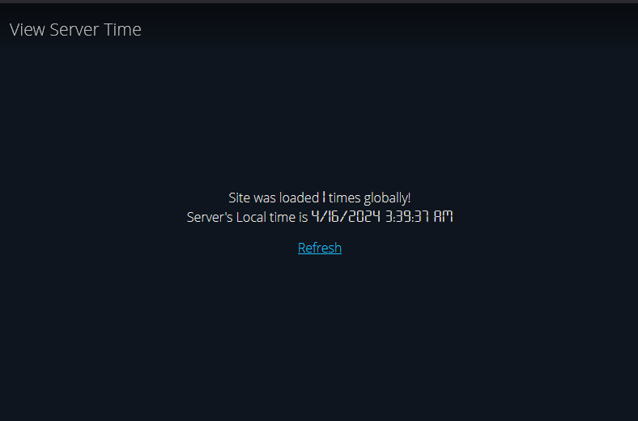
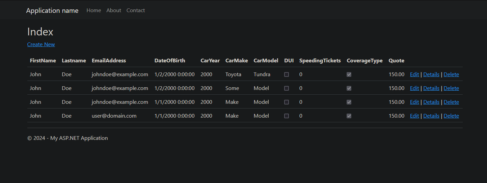
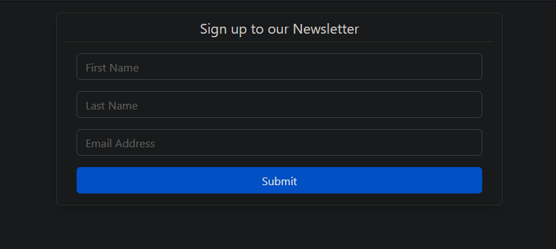

# C# and .NET Projects
Welcome to my journey through the world of C# and .NET! Below you'll find a showcase of some of the exciting projects I've had the pleasure of working on during my time at the Tech Academy.\
- [C# and .NET Projects](#c-and-net-projects)
- [Console-based Apps](#console-based-apps)
  - [Assignments](#assignments---view-source)
    - [How it works](#how-it-works)
    - [Features](#features)
    - [Result](#result)
  - [Blackjack](#blackjack---view-source)
    - [How it works](#how-it-works-1)
    - [Features](#features-1)
- [MVC Applications](#mvc-applications)
  - [Server Local Time](#server-local-time---view-source)
    - [How it works](#how-it-works-2)
    - [Features](#features-2)
  - [Car Insurance](#car-insurance---view-source)
    - [How it works](#how-it-works-3)
    - [Features](#features-3)
  - [Newsletter Subscription App](#newsletter-subscription-app---view-source)
    - [How it works](#how-it-works-4)
    - [Features](#features-4)
- [Contact](#contact)

Each project is a testament to my growth as a developer and my passion for mastering new technologies.
For a comprehensive list of all projects and their respective source code at my time with the Tech Academy, click [here](./Assignments).

# Console-based Apps
These are the apps that are ran on a text interface and only allow text input. Useful for backend applications or Utilities

## Assignments - [View Source](./Assignments/Assignments)
I made this project when I got frustrated having to create a new project per assignment. From my perspective _(as a student)_ it be a more practical to grade assignment when they were in a single C# project instead of switching between projects to evaluate each assignment.\


### How it works
Each assignment is a class that must inherit `IAssignment`, and define its StepId and Name. Once the user wants to test an assignment, `Invoke()` is called to run the assignment
```csharp
public interface IAssignment {
    ushort Step { get; } // Unique assignment ID from the LMS
    string Name { get; } // Assignment name for display purposes
    void Invoke();       // Entrance point, analogous to Main()
}
```
### Features
 - **Modular Design** - Assignments are represented as individual classes, making it easy to track assignment since its one file _(as apposed to 4, current)_
 - **Standardized Interface** - The `IAssignment` interface enforces a consistent structure across all assignments
 - **Efficient Grading** - With all assignments consolidated within a single project, in theory, grading becomes more efficient and convenient since you won't need to switch projects to test/grade an assignment

### Result
I made this program from a students perspective, what seems practical in my sense did not seem practical from a instructors viewpoint. I reverted to making separate projects per assignment, but I assume the instructors had an automated method for testing and in this context it was impractical to use an application with non-constant indexes (since the latest assignment would become the first assignment in the listing, bumping all other assignments lower)

## Blackjack - [View Source](./Assignments/Blackjack)
This project is a simple implementation of the card game Blackjack _(also known as 21)_. The goal of this project was to become familiar with class structures (and inheritance) and functional programming\


### How it works
Initially the app is in a main menu state, asking for your name and what balance you want to start off with. Since we didn't implement any other game it creates a round of Blackjack, every player is then asked to hit or stay. The player with the highest hand that is not over 21 wins

### Features
 - **Abstract Player Implementation** - There are multiple layers of abstraction, from the base `Player` class that is tied to each `Game<T1, T2>` object. This lets the `BlackjackDealer` also be a `Blackjack` player and able to hit/stay without extra logic in the core game itself
 - **Input Validation** - Players can interact with the game through a simple text-based interface, which has support to parse any value from a `bool` to a `enum` with a custom `ReadNumeral<T>` extension
 - **Card Handling** - The game simulates a standard deck of 52 playing cards, with functionalities for shuffling and dealing cards to players and the dealer
 - **Scoring System** - The game is aware of the Ace card that can either be a one or eleven
 - **Error Prevention** - Basic error handling ensures that the game gracefully handles invalid user input and other unexpected situations through `TryDraw(out)` methods, which also helps nested try/catches and makes handling much easier
 - **Error Handling** - In the event of an error, the application self-reports exceptions (including unhandled/uncaught) onto a SQL Server via ADO.NET

# MVC Applications
These are projects based on Microsoft's Model-View-Controller _(MVC)_ programming. MVC helps in separating the application into three separate parts, making it easier to maintain and scale. It promotes modularization and reusability by dividing the application into three interconnected components, and does Server-side rendering to return only whats needed to the client.
 - **Model** - Represents the data and business logic of the application. It encapsulates the data and behavior of the application domain, including operations like data validation, manipulation, and persistence
 - **View** - Represents the presentation layer of the application. It's responsible for displaying the user interface elements and presenting the data to the user. These primarily contain only whats shown in the UI, it doesn't query databases, files, etc
 - **Controller** - Acts as an intermediary between the Model and the View. It handles user input and updates the Model accordingly. It also updates the View in response to changes in the Model

## Server Local Time - [View Source](./Assignments/ServerLocalTimeMVC)
This was a project to publish a .NET Core MVC Application onto the Azure Cloud. The application within itself was not complicated, it consisted of a single page showing the local server's time in the center of the screen, you also got a visit counter/metric.\


### How it works
There are three components, there is a Controller that keeps track of how many times the page was hit, and sends it as the Model to the View, which then puts that in the visit counter. The View then takes a uses `DateTime.Now` to get the servers local time and returns it to the browser

### Features
 - **Visit Counter** - The Controller keeps track of all the times that the page was requested and displays it to the user
 - **Lightweight Build** - The page consists of one page, a single css File and two fonts

## Car Insurance - [View Source](./Assignments/CarInsurance)
This project was to make a CRUD app _(<ins>C</ins>reate, <ins>R</ins>ead, <ins>U</ins>pdate and <ins>D</ins>elete)_ where you could add/remove customer insured by your insurance company, and see their quote. By default the initial quote would be generated by the system, but you'd be able to change it afterwards\


### How it works
It utilizes Entity Framework to store and retrieve quotes. You can then add customers

### Features
 - **CRUD Functionality** - The app performs CRUD _(Create, Read, Update, Delete)_ operations on customer records. Through an interface, users can add, remove, and update customer details, including personal information and insurance coverage
 - **Two Database Implementations** - You can only utilize one at a time though
   - **ADO.NET Implementation** - Utilized ADO.NET to load/save data, requires more setup time, but does increase app performance _(based on my own tests)_
   - **Entity Framework** - Used the Entity Framework library as the second implementation as a seamless and persistent storage to a SQL Database using Data Models
 - **Data Persistence with an SQL Server** - Made a SQL Server database to arrange, organize and query data which allows data to be efficiently stored and retrieved
 - **Interactive User Interface** - With a sleek and intuitive user interface, the application provides a seamless user experience, facilitating efficient navigation and interaction. From comprehensive search functionalities to interactive forms for data entry, every aspect of the user interface is designed with usability and productivity in mind


## Newsletter Subscription App - [View Source](./Assignments/NewsletterMVC)
This was a project to publish a .NET Core MVC Application onto the Azure Cloud. The application within itself was not complicated, it consisted of a single page showing the local server's time in the center of the screen, you also got a visit counter/metric.\


### How it works
This was a project to get familiar with MVC and ADO.NET. The app itself contains a sign up form and an administrative page to remove subscriptions, if that ever becomes necessary.  

### Features
 - **A Signup Form** - The form has validation to ensure you are entering valid information. I wanted to also add captcha support, but that was out of scope for what this project was for
 - **Administrative Panel** - The panel was used to see how long a user was unsubscribed for and when they unsubscribed. Your also able to unsubscribe anyone from the view.

# Contact
If you'd like to reach out, feel free to visit my [website](https://kavemans.dev/contact)